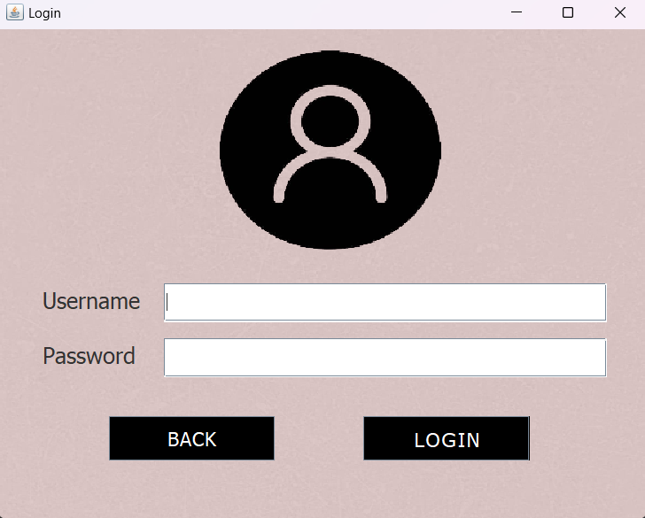
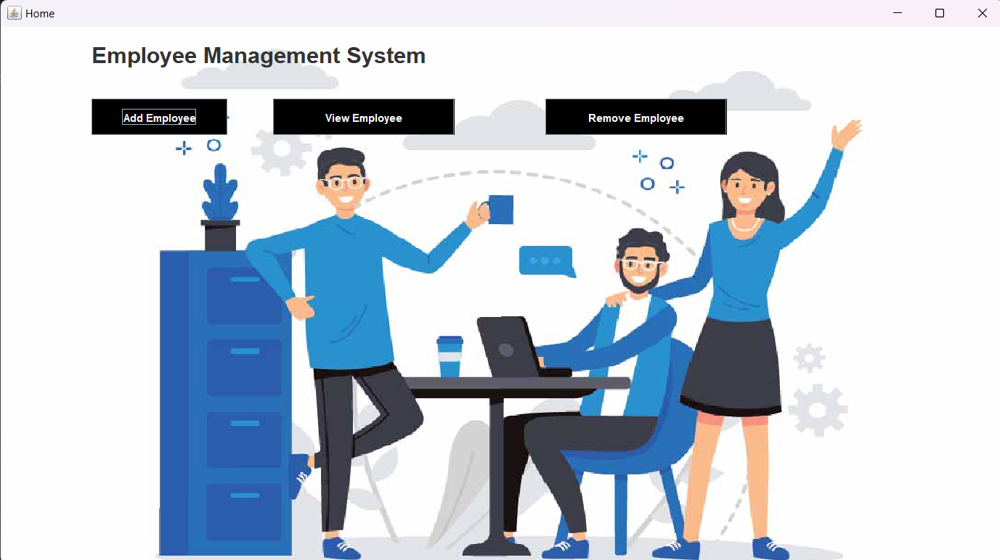
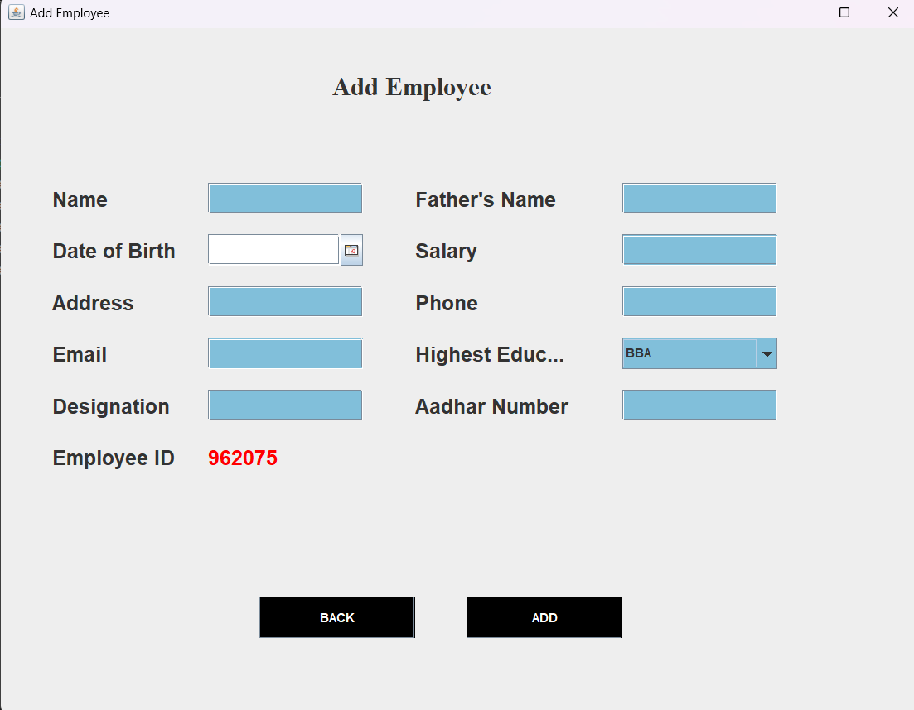
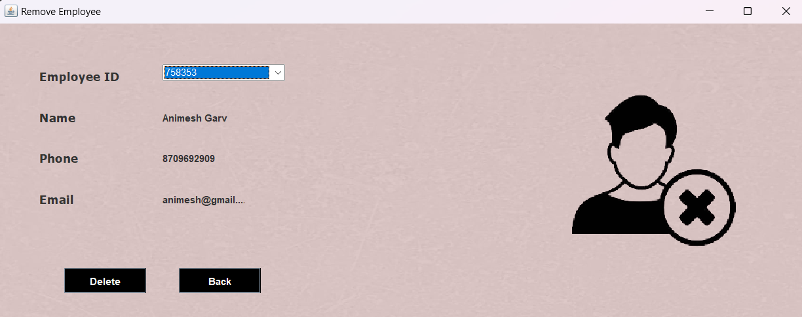

# 🌟 Employee Management System 🌟

An Employee Management System developed in Java, utilizing MySQL for database operations. This project provides a user-friendly interface to manage employee details efficiently.

## ✨ Features

- ➕ Add new employees
- ✏️ Update existing employee details
- ❌ Delete employee records
- 📋 View all employee information
- 🔍 Search for specific employees

## 💻 Technology Stack

- **Frontend:** Java Swing (GUI)
- **Backend:** Java AWT, Java SQL package
- **Database:** MySQL

## 📦 Packages Used

The following Java packages are utilized in this project:

- 📄 `java.sql` - For database connectivity and operations
- 🎨 `java.awt` - For graphical interface components
- 🖼️ `javax.swing` - For enhanced GUI elements
- 🖱️ `java.awt.event` - For handling user interactions
- ✍️ `java.awt.Font` - For custom font styles in the GUI

## ⚙️ Prerequisites

Ensure the following are installed on your system:

1. ☕ **Java Development Kit (JDK)** - Minimum version: 8
2. 🐬 **MySQL Server** - To host the database
3. 🖥️ **IDE** (Optional) - Recommended: Visual Studio Code, IntelliJ IDEA, Eclipse, or NetBeans

## 🛠️ Setup Instructions

### Step 1: Clone the Repository

```bash
git clone https://github.com/Aasthayuli/Employee-Management-System
```

### Step 2: Import Database

Open MySQL Workbench or any MySQL client.
Create a new database, e.g., employeemanagement.
Import the provided employeemanagement.sql file into your MySQL server.

### Step 3: Configure Database Connection

Update the database connection details in the Java code:

```
String url = "jdbc:mysql://localhost:3306/employeemanagement";
String username = "your_mysql_username";
String password = "your_mysql_password";
```

### Step 4: Add Libraries to Your Project

1. Download the required JAR files or you can just simply use these existing jar files in the lib folder.

- mysql-connector-j-9.2.0.jar
- com.toedter.calendar.jar
- ResultSet2xml.jar

2. Add these JAR files to your project's build path:

- In IntelliJ IDEA: File > Project Structure > Libraries > Add JARs or Directories
- In Eclipse: Right-click project > Build Path > Configure Build Path > Add External JARs

### Step 5: Run the Project

1. Open the project in your IDE.
2. Locate the main file, e.g., HomePage.java or EmployeeManagementSystem.java.
3. Compile and run the file using your IDE's "Run" option.

Example Command for Terminal:

```bash
javac -cp ".;mysql-connector-j-9.2.0.jar;com.toedter.calendar.jar;ResultSet2xml.jar" Main.java
java -cp ".;mysql-connector-j-9.2.0.jar;com.toedter.calendar.jar;ResultSet2xml.jar" Main
```

## 🖼️ Screenshots






## 📜 License

This project is licensed under the MIT License. See the [LICENSE]() file for more details.

## 👨‍💻 Author

Aasthayuli

If you like this project, please give it a ⭐ on GitHub!
